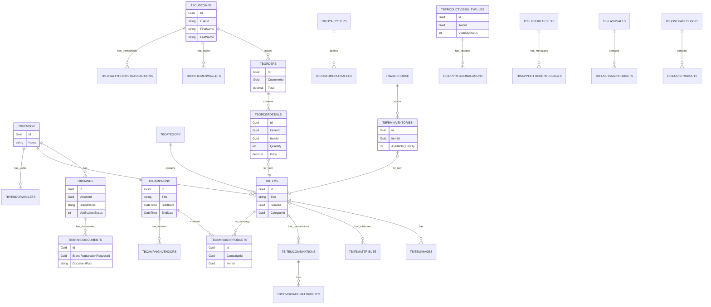

# ????? ????? ???????? ?????? ?? ????

????? ????? ????? ??????? ???????? ?? `ApplicationDbContext` ?? ??? ????? ??? ????? ?? ???? ERD ????? ????? Mermaid.

> ??????: ??????? ??????? ?????? ?? `ApplicationDbContext` ?? ???????. ??? ??????? ?? ??????? ??? ?????? (Domain) ?????? ???????.

---

## 1. ????? ??????? ??????? (Catalog / Attribute / Category)
- `TbAttributes`  
  ???? ????? (Attributes) ?????? — ???? ??????? ?????? ????????.
- `TbAttributeOptions`  
  ?????? ?? ????? (??? ?????? ?????).
- `TbCategories`  
  ???? ????????? (???????) ???????? ????????.
- `TbCategoryAttributes`  
  ??? ????????? ???????? ??????? ???.

## 2. ????? ???????? ????????
- `TbBrands`  
  ???? ????????? (Brand) ????????? ????????? ?????????.
- `TbBrandRegistrationRequests`  
  ????? ????? ????? ????? ?? ????????.
- `TbBrandDocuments`  
  ??????? ????? ??? ??? ????? ?????.
- `TbAuthorizedDistributors`  
  ?????? ?????? ??????? ????????.

## 3. ?????? ????????
- `TbCurrencies`  
  ??????? ????????.
- `TbPriceHistories`  
  ??? ????? ???????.
- `TbQuantityPricings`  
  ????? ??? (????? ????? ??? ????).
- `TbCustomerSegmentPricings`  
  ????? ??? ????? ???????.

## 4. ????? ??????? (Items)
- `TbItems`  
  ???? ???????? (Items).
- `TbItemAttribute`  
  ??? ????? ??????.
- `TbItemAttributeCombinationPricings`  
  ????? ??????? ???? ??????.
- `TbItemImages`  
  ??? ??????.
- `TbItemCombinations`  
  ?????? ?????? (??? ???? - ??? - ??? ??????).
- `TbCombinationAttributes`  ? `TbCombinationAttributesValues`  
  ????? ????? ???????? ??? ??????.

## 5. ????????? ??????????
- `TbCouponCodes`  
  ????? ?????/???.
- `TbSettings`  
  ??????? ???? ??????.

## 6. ????? ???????? ???????????
- `TbShippingCompanies`  
  ????? ?????.
- `TbUnits`  
  ????? ????.
- `TbUnitConversions`  
  ??????? ???????.
- `TbWarehouses`  
  ???????? ???????.

## 7. ?????? ????????
- `TbCountries`, `TbStates`, `TbCities`  
  ????? ?????? (???? ?????? ?????).

## 8. ???????? ????????
- `TbVendors`  
  ??????? ????????.
- `TbCustomers`  
  ??????? ???????.

## 9. ??????? ????? ??????
- `TbCustomerWallets`, `TbVendorWallets`, `TbWalletTransactions`, `TbPlatformTreasuries`  
  ????? ??????? ?????????? ?????????? ?????? ??????.
- `TbLoyaltyTiers`, `TbCustomerLoyalties`, `TbLoyaltyPointsTransactions`  
  ???? ??????? ?????? ???? ???? ???????.

## 10. ??????? ???? Flash Sales
- `TbCampaigns`  
  ????? ???????.
- `TbCampaignProducts`, `TbCampaignVendors`  
  ??? ???????? ????????? ???????.
- `TbFlashSales`, `TbFlashSaleProducts`  
  ??????? ????? ?????????.

## 11. ????????? ??????????
- `TbProductReviews`, `TbSalesReviews`, `TbDeliveryReviews`, `TbReviewVotes`  
  ??????? ???????? ????????? ??????????.

## 12. ????????? ??????????
- `TbNotifications`, `TbUserNotifications`, `TbNotificationChannels`, `TbNotificationPreferences`  
  ????? ??????? ??????? ????????? ????? ??????? ??????????.

## 13. ??????? ????????
- `TbPages`, `TbContentAreas`, `TbMediaContents`  
  ????? ?????? ???????? ????????.

## 14. ??? ??????? (Support)
- `TbSupportTickets`, `TbSupportTicketMessages`, `TbDisputes`, `TbDisputeMessages`  
  ????? ????? ????? ??????? ?????????.

## 15. ?????? ????????? (Offers / Warranty)
- `TbOffers`, `TbOfferCombinationPricings`, `TbOfferConditions`, `TbWarranties`, `TbUserOfferRatings`  
  ????? ???? ??????? ?????? ????????.

## 16. ??????? ?????? (Order)
- `TbOrders`, `TbOrderDetails`, `TbShippingDetails`, `TbRefundRequests`  
  ????? ??????? ??????? ?????? ?????? ?????? ?????????.

## 17. ???????? ?????? (Fulfillment & Inventory)
- `TbFulfillmentMethods`, `TbFBMInventories`, `TbFulfillmentFees`, `TbFBMShipments`  
  ??? ??????? (FBS/FBM)? ????? ??????? ???? ???????? ?????? FBM.
- `TbMoitems`, `TbMortems`, `TbMovitemsdetail`  
  ????? ?????? ?????? ??????? (??? ??????? ?? ???????).

## 18. ??????? ??? ?????? ????????
- `TbHomepageBlocks`, `TbBlockProducts`  
  ??? ????? ??? ??????? ???? ???????? ???????.

## 19. ???? ???????? (Visibility)
- `TbProductVisibilityRules`, `TbSuppressionReasons`, `TbVisibilityLogs`  
  ????? ????/????? ??????? ????? ??????? ???? ?????????.

## 20. ??????? ???????
- `TbVideoProviders`  
  ????? ??????? (YouTube, Vimeo ...).

---

# ERD ??????? (Mermaid)

???? ???? ??? ???????? ???????? ????????? ?????. ????? ???? ?? ?? ???? ???? Mermaid (??? VS Code ?? ???? Mermaid) ?? ?????? ??? ???? ???????? ????? Mermaid.

---

# ????? ????? ??? ????? ????? ???????? (?????? ???? ??????? ???????? ???)

????? ????? ?? `DbSet<>` ??????? ?? `ApplicationDbContext` (?????? ??????) ?? ??? ???? ?????? ?? ????.

> ??????: ??? ??????? ?? ??????? ?? `src/Infrastructure/DAL/ApplicationContext/ApplicationDbContext.cs`? ?????? ??? ???? ??????? (Entities) ?Views ??????? ????.

---

## ????? (Tables) - ?????? ??? ??????

### Attribute & Category Management
- `TbAttributes` — ????? ?????? ?????? (?????: ?????? ?????).
- `TbAttributeOptions` — ?????? ?? ????? (????? ????? ???????).
- `TbCategories` — ???????/????? ????????.
- `TbCategoryAttributes` — ??? ????????? ???????? ??????? ???.

### Brand Management
- `TbBrands` — ????????? (???????? ????????) ???????/????????.
- `TbBrandRegistrationRequests` — ????? ????? ????? ????? ?? ????????.
- `TbBrandDocuments` — ??????? ????? ?????? ????? ???????.
- `TbAuthorizedDistributors` — ?????? ?????? ??????? ????????.

### Currency Management
- `TbCurrencies` — ??????? ????????.

### Item Management
- `TbItems` — ???????? (Items).
- `TbItemAttribute` — ??? ??????? ????????.
- `TbItemAttributeCombinationPricings` — ????? ????? ??????? ?????? (combinations pricing).
- `TbItemImages` — ??? ????????.
- `TbItemCombinations` — ?????? ?????? (?????: ???? ?????+???).
- `TbCombinationAttributes` — ????? ????? ????????.
- `TbCombinationAttributesValues` — ??? ????? ????????.

### Notification Management
- `TbNotifications` — ?????/??????? ?????? ??????.
- `TbUserNotifications` — ??????? ????? ??????????.
- `TbNotificationChannels` — ????? ????????? (Email, SMS, Push ...).
- `TbNotificationPreferences` — ??????? ????? ????????.

### Page & Content Management
- `TbPages` — ????? ??????? ??????? (CMS pages).
- `TbContentAreas` — ????? ????? ??? ????? (sections).
- `TbMediaContents` — ?????/????? ????? ???????.

### Coupon & Settings
- `TbCouponCodes` — ????? ???????/?????????.
- `TbSettings` — ??????? ??????/????? ???????.

### Shipping & Units
- `TbShippingCompanies` — ????? ????? ?????????.
- `TbUnits` — ????? ?????? (????? ???? ...).
- `TbUnitConversions` — ??????? ??? ???????.

### Location (Geo)
- `TbCountries` — ???.
- `TbStates` — ??????/????? ???? ?????.
- `TbCities` — ???.

### Vendor & Customer
- `TbVendors` — ?????? ????????.
- `TbCustomers` — ?????? ???????.

### Video Provider
- `TbVideoProviders` — ????? ??????? (YouTube, Vimeo ...).

### Support & Disputes
- `TbDisputes` — ?????? / ????? (disputes).
- `TbDisputeMessages` — ????? ?????? ?????????.
- `TbSupportTickets` — ????? ??? ???????.
- `TbSupportTicketMessages` — ????? ???? ????? ?????.

### Review Management
- `TbProductReviews` — ??????? ???????? ?? ???????.
- `TbSalesReviews` — ??????? ????? ????? (seller review).
- `TbDeliveryReviews` — ??????? ???????.
- `TbReviewVotes` — ??????? ??? ????????? (up/down votes).

### Warehouse / Inventory
- `TbWarehouses` — ?????/????????.
- `TbMoitems` — ????? ???? ????? (MO items).
- `TbMortem` — ????? ????? Mortem (??? ????? ???????? ????? ????? ?????? ?????).
- `TbMovitemsdetail` — ?????? ????? ???????.

### Loyalty System
- `TbLoyaltyTiers` — ??????? ?????? ?????? (tiers).
- `TbCustomerLoyalties` — ??? ??????? ?????? ?????? ????????? ??? ?????.
- `TbLoyaltyPointsTransactions` — ??? ??????? ???? ?????? (???/?????).

### Wallet System
- `TbCustomerWallets` — ????? ???????.
- `TbVendorWallets` — ????? ????????.
- `TbWalletTransactions` — ??????? ??????? (?????/???/?????).
- `TbPlatformTreasuries` — ????? ??????/????? ??????.

### Buy Box / Seller Performance
- `TbBuyBoxCalculations` — ?????? BuyBox.
- `TbBuyBoxHistories` — ????? ????? BuyBox.
- `TbSellerPerformanceMetrics` — ?????? ???? ????????.

### Seller Requests
- `TbSellerRequests` — ????? ???????? (??????? ??????? ...).
- `TbRequestComments` — ???????/??????? ??? ???????.
- `TbRequestDocuments` — ??????? ????? ??? ???.

### Campaign & Flash Sales
- `TbCampaigns` — ??????? ?????????.
- `TbCampaignProducts` — ?????? ?????? ??? ????.
- `TbCampaignVendors` — ?????? ??????? ?? ??????.
- `TbFlashSales` — ??????? ????? (Flash Sales).
- `TbFlashSaleProducts` — ?????? ???? ??????.

### Fulfillment (FBS/FBM)
- `TbFulfillmentMethods` — ??? ??????? (FBS, FBM ...).
- `TbFBMInventories` — ????? ???????? ?????? FBM.
- `TbFulfillmentFees` — ???? ???????.
- `TbFBMShipments` — ????? FBM ???????.

### Advanced Pricing
- `TbQuantityPricings` — ????? ????? ??? ??????.
- `TbCustomerSegmentPricings` — ????? ??? ????? ???????.
- `TbPriceHistories` — ????? ????????? ??? ?????.

### Homepage Merchandising
- `TbHomepageBlocks` — ??? ??? ??? ?????? ????????.
- `TbBlockProducts` — ?????? ???? ?? ????.

### Seller Tier Management
- `TbSellerTiers` — ??????? ???????? (Seller tiers).
- `TbSellerTierBenefits` — ?????/????? ?? ?????.
- `TbVendorTierHistories` — ??? ????? ????? ??????.

### Product Visibility
- `TbProductVisibilityRules` — ????? ?????/????? ??????.
- `TbSuppressionReasons` — ????? ?????/??????? (suppression reasons).
- `TbVisibilityLogs` — ??? ??????? ??????.

### Brand Management Advanced
- `TbBrandRegistrationRequests` — (????? ?????) ????? ????? ?????.
- `TbBrandDocuments` — (????? ?????) ??????? ???????.
- `TbAuthorizedDistributors` — (????? ?????) ?????? ??????.

### Offer / Warranty / Ratings
- `TbOffers` — ???? ???????.
- `TbOfferCombinationPricings` — ????? ??????? ?????.
- `TbOfferConditions` — ???? ????? ??????.
- `TbWarranties` — ????? ????????.
- `TbUserOfferRatings` — ??????? ?????????? ??????.

### Order Management
- `TbOrders` — ????? ??????.
- `TbOrderDetails` — ?????? ???? ?????.
- `TbRefundRequests` — ????? ???????/?????.
- `TbShippingDetails` — ?????? ????? ???????? ??????.

---

## Views (Keyless entities / database views)
- `VwAttributeWithOptions` — ??? ?????? ?????? ?? ????????.
- `VwCategoryItems` — ??? ?????/?????? ??? ????.
- `VwCategoryWithAttributes` — ??? ?????? ?? ???????.
- `VwItems` — ??? ????? ??? Items (?? view ?????).
- `VwUnitWithConversionsUnits` — ??? ????? ???????.
- `VwUserNotification` — ??? ??????? ???????? ???????.

---

??? ???? ??? Markdown ???? ????: ????? ?? ?????? (Properties) ??? ???? ????????? ??????? (FKs) ??? ????? ERD ???? ??? ?? ??????? ?????????? ?????? ?????? ???????? ?????? ????? `Domains.Entities.*`.
